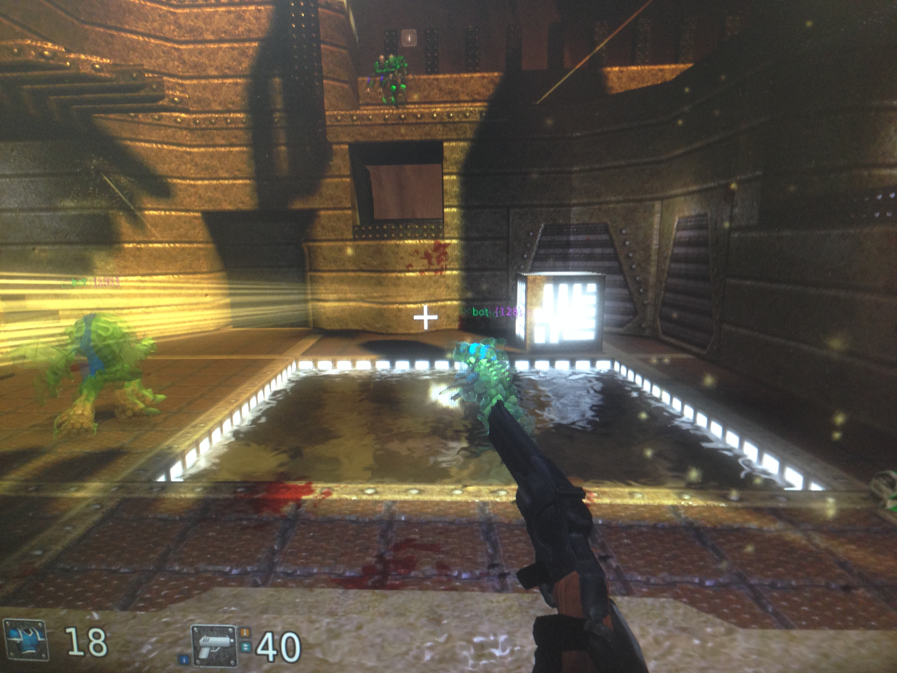
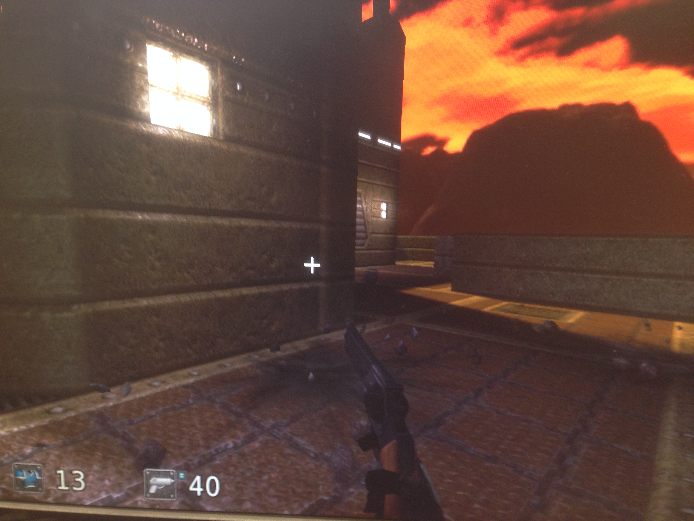

#Experimental Design
##Accuracy Test
The first I'm using is to determine the accuracy of firing for Cube2. In theory, a better controller will be easier to use and the player should therefore be more accurate in the game. To test this, in the shotevent process, I write out to file a declaration that the player fired and another line if he does damage. To keep track of which player is which, I write out everything that is not a bot, since keeping track of bot shooting is not indivicative on player or controller perforamnce.

<pre><code>
if (strcmp(playerName,"bot") != 0) {
	   fprintf(accuracyTest, "Player %s fired!\n", playerName);
	}
accuracyTest = fopen("accuracyTest.txt","w");
deathTest = fopen("deathTest.txt","w");
        if ((accuracyTest == NULL)||deathTest == NULL) {
	  printf("Error opening file !\n");
	  exit(1);
	}
</code></pre>

To measure this, I count the number of total shots in the file and the total number of shots that did damage. Then divide one over the other to find the accuracy percentage.

##Death Test
This is very straightforward, everytime you die, I write out to file that you did so.

<pre><code>
if(ts.health<=0)
        {
	    char* playerName = target->name;
	    if (strcmp(playerName,"bot") != 0) {
	      fprintf(deathTest, "Player %s died!\n", playerName);
	    }
</code></pre>
In theory, a better controller will allow you to manuer the joysticks and bottons more comfortably and should therefore die less.

#Experiment with keyboard and mouse input type

##Slow Firmware
The firmware that I wrote for last week's lab actually used Mouse.click() and Keyboard.write(key). To fire, you must press the right trigger button and there is a slight delay before the gun fires. Also, if you hold it down nothing happens. For the asdw, this means you need to keep shifting the joystick a direction to move and not just hold it there. After testing it on Cube2, it seems the asdw movement is extremely slow, since as it was coded there is a delay to each press of a button on the keyboard. This resulted in an extremely clucky movement, so I decided to test this first. I played a 10 minutes game of free for all with 5 bots on all skill level 50 and map aard3c. The result was 11 deaths (1.1 deaths per minute). In the time, I fired 348 shots total, hitting only 18, for an accuracy of around 5%. I think the fact that I couldn't move around as quickly forced me to camp out in this little region in the map below.

##"Normal" Firmware
I played another 10 minute ffa game with 5 bots all on lowest level on map aard3c. I died a total of 18 times (1.8 deaths per minute). In the time, I fired 297 shots and hit 28 of them ( a 9% accuracy). During this game, I was able to move around more freely and aim at the bots as they moved around. One thing I noticed is I wasn't camping nearly as much and fought mostly on a different corredore in the open. I've submitted the new firmware that I'm using as part of this lab and you can see the difference between them. One interesting thing I'm going to do it to allow both firmwaves by using the switch, since there are advantages to both.

Conclusion: In conclusion, I found that both firmwares have different strengths and weaknesses. If you are interested in staying still and just camping, the click() firmware works fine. If you need a lot of movement in your style of play, then the pressed() firmware is better. I'm more accurate on the fast firmware, but also take more shots since there is not always a person in front of me. If you camp in a good area, there is almost always someone to shoot at. In an actual game against non-bots, the fast firmware is definately better since camping against humans is more difficult.
