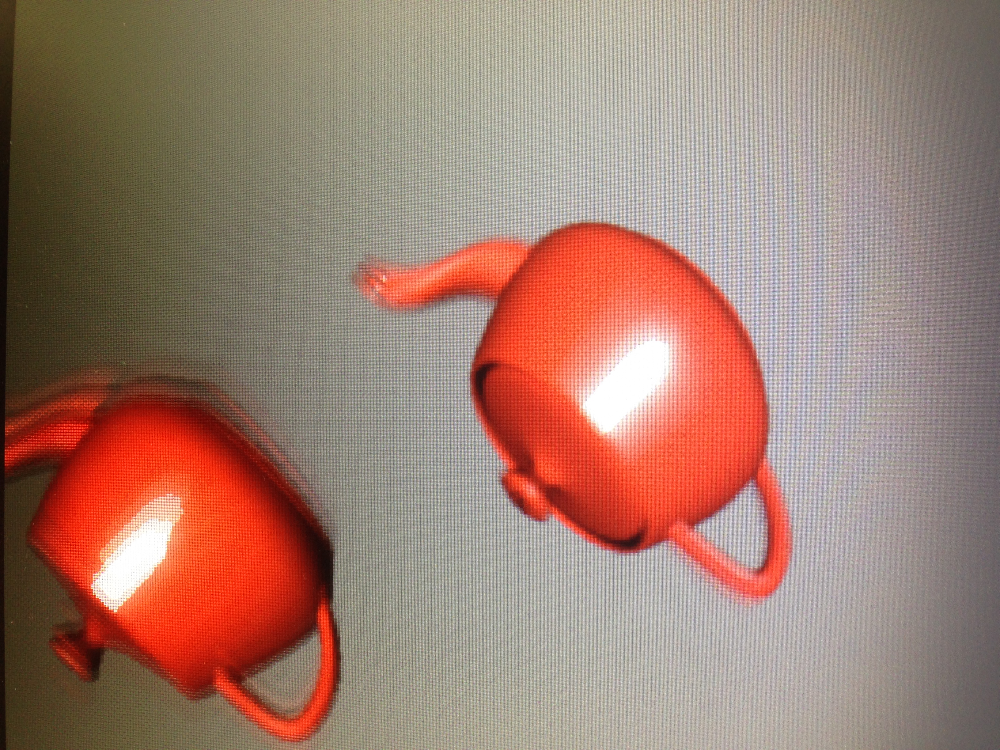
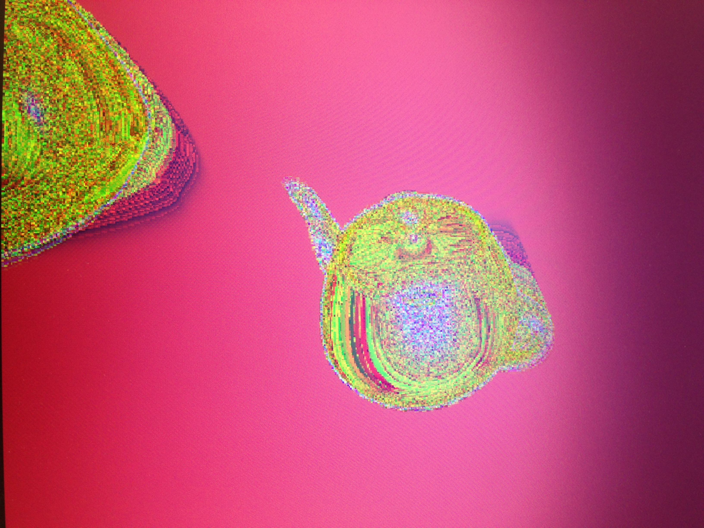

#Motion Blur
##Algorithmic Overview
I did a motion blur for this lab. To review, a motion blur is when you take into account where the object was
previously to determine where the object currently should be drawn. For example, if an object is moving at 
high speeds, it looks like a blur due to the motion blur. To do this with code, I kept track of where the
object was before the current iteration of the global function CudaProcess. We can choose at each iteration how
much to weight where the object was before. The weight of the factor is at most less than 1 because weighing more 
than 1 at any given time would cause the entire screen to go red. The major code changes are below, to see the 
actual code from the changes, please go to https://github.com/patrickdgr81/e190u-1/tree/master/cuda/postProcessGL

<pre><code>
g_odata[y*imgw+x] = rgbToInt(rsum, gsum, bsum)+0.05*motionBlur*g_odataCopy[y*imgw+x];
    g_odataCopy[y*imgw+x] = g_odata[y*imgw+x];
</code></pre>

I also passed around the previous interation, which is g_odataCopy and how much to blur by, which is motionBlur. 
This changes the method signature to

<pre><code>
launch_cudaProcess(dim3 grid, dim3 block, int sbytes,
                   cudaArray *g_data_array, unsigned int *g_odata,
                   int imgw, int imgh, int tilew,
                   int radius, float threshold, float highlight, int motionBlur, unsigned int*g_odataCopy)
</code></pre>
The second change I did was make a second ball that oscillated just behind the teacup. This ball makes it easier to
see motion blur.

##Results
The results were as expected, the object be

