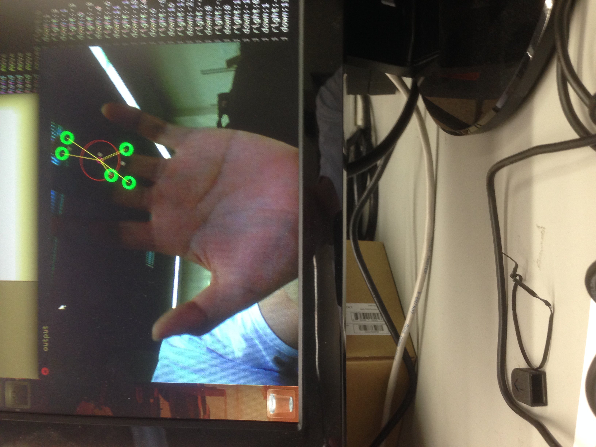

#Summary
In this lab I modified the sample code in hand.c to allow detection of hand movement.
The actual code is in the repository opencv-hand-detection. I created a new variable in
the struct ctx to store the previous found palm location. In each iteration of find_convex_hull,
I update to the new palm location if there is one and check how much the palm moved.

The program was inconsisent in detecting the location of my hand. To resolve this, I relaxed the constraint that there must be 5 fingers found or else the display would not show it. Now if there are 4 or 5 fingers, the display will assume it is a hand. In the testing I did, there did not seem to be any nonhand objects being detected.

<pre><code>
hand moved right:0
hand moved down:1
hand moved right:3
hand moved down:-1
hand moved right:-3
hand moved down:0
hand moved right:-3
hand moved down:-4
hand moved right:-6

hand moved right:295
hand moved down:-170
hand moved right:-345
hand moved down:177
hand moved right:32
hand moved down:-69
hand moved right:-22
hand moved down:-35
hand moved right:-18
hand moved down:44
hand moved right:29
hand moved down:11

</code></pre>

