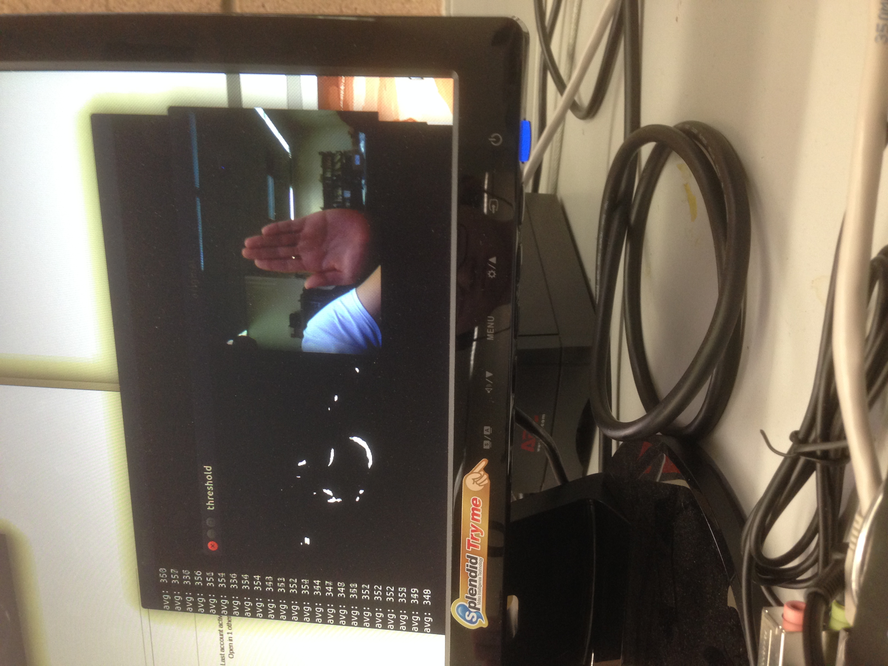
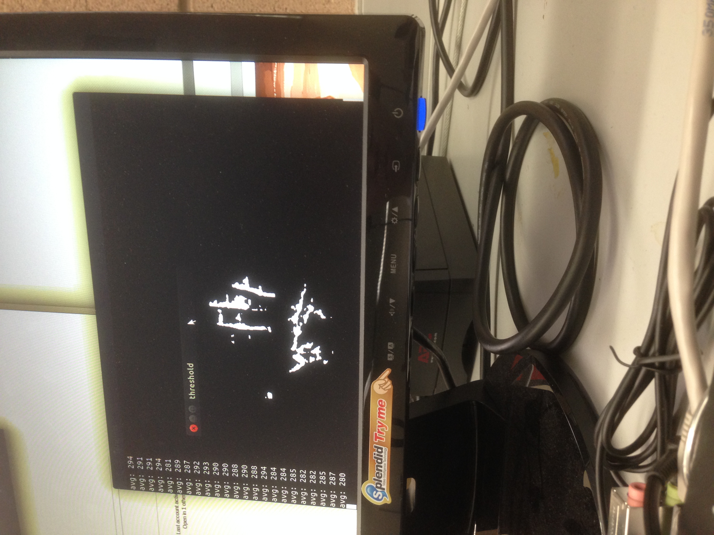

#Lab 5
##Summary
In this lab I created a program to detect hand movement.
The actual code is in the repository opencv-hand-detection, file called bgfg_segm.cpp. In each iteration of find_convex_hull, I update to the new palm location if there is one and check how much the palm moved. However, this is too slow on the cpu, so I had to transition to the gpu instead. We start by reading a frame from the camera, then we run an iteration of gaussian blur and threshold on the GPU. The Gaussian blur was done with default paramters while the threshold was done by looking at only rgb values from 0 to 70 for r, 55 to 175 for g and 90 and 230 for b. After this, we find the convex hull using the buitl in function convexhull(). This allows us to find the hand under most lighting conditions. Each time, we find the average pixel value of the hand to find the y coordinate of the hand and if the hand moved at all.

##Background
We were given some code in hand.c that already determined hand location somewhat reasonably. However, it was inconsistent because it required the algorithm to find 5 fingers before it does anything and is extremely slow. Under the code in revision "in process of converting from c to cpp" of hand.c, you can see at the bottom I ran some tests to determine what the slowest components of this process were. It turned out filtering and threshold took 2000 units of time, compared to roughly 500 from the entire rest of the algorithm. So this was why i decided to try to filter and process on gpu.

## Sample Tests

As you can see the y value detected changed based on where the hand was. The hand detection is still suspect at different angles and different lightings.
