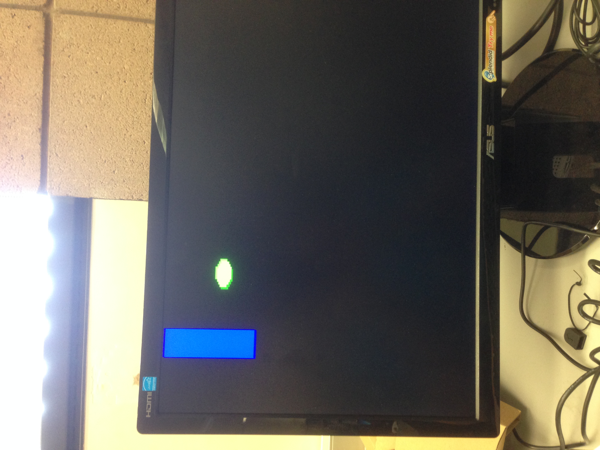

#Lab 6
##Summary
In this lab I implemented Pong to allow the user to use hands to move up and down to play a game of pong. First of all
it was difficult to open up a function call to C using the python files that were given, so I decided to build my own
Pong in C++. The Pong base code I used can be found at http://www.cppgameprogramming.com/cgi/nav.cgi?page=pong.

To compile the file, run
g++ pong.cpp -o pong `allegro-config --libs` -lopencv_core -lopencv_highgui -lopencv_gpu 
-lopencv_imgproc -lopencv_video

The code can be found in the opencv hand detection repository.
In this file, originally it was checking for the buttons W and S to move up and down. I repackaged the code
in  hand.c to provide a setup and a findMovement method. Instead of checking for w and s, we check if the value of 
y of the average pixel changed up or down. This is the same as moving up or down. 

##Sample Run

In the code, there is some glitching when we are trying to hold the hand still, but it detects +/- 1. It moves
up and down really quickly. It also has a tendency to move upwards for some reason, because ranges go something like 270,
271,272,273,274,275,270. Kinda weird, but there are some ways to resolve this. The game code itself also seems werid
where the computer player's board runs out of the screen.

